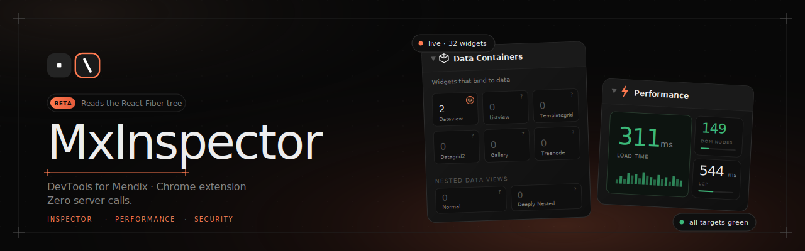

  

  
  
  

  <strong>Dockable Chrome extension that drops onto any running Mendix app</strong> 
  and surfaces the object graph, live data sources, performance, security, and accessibility — 
  reading directly from the React Fiber tree. <strong>Zero server calls.</strong>

  <a href="https://mxinspector.com/">Website</a> ·
  <a href="https://github.com/tapmaurer-repo/mendix-inspector/releases">Releases</a> ·
  <a href="#installation">Install</a> ·
  <a href="#compatibility">Compatibility</a>

---

## Features

- **Data Inspector** — walks the page's object graph (Page Parameters, Context Objects, On-Page entities, Cached). Search attribute values, copy GUIDs, trace associations, see dirty-state flags. Hover a row to pulse the matching container on the page; click to pin.
- **Performance** — installs at `document_start` and wraps XHR + fetch before your app boots, so the numbers you see are what actually happened. Page load metrics, Core Web Vitals, per-navigation buckets, live data sources (every `/xas/` call captured, deduped by operationId).
- **Security & Accessibility** — surface-level insights on both, with WCAG-flavored accessibility checks and runtime security hints.
- **Client-only** — runs entirely in the browser. Walks the React Fiber tree for Mendix 10+ and the dijit registry for Dojo. No `mx.data` calls.

## How it works

1. **Inject** — the perf tracker installs at `document_start`. `world: 'MAIN', run_at: 'document_start'`. Auto-unhooks on non-Mendix pages after 3s.
2. **Extract** — reads `memoizedProps` directly to surface MxObjects via `Symbol(mxObject)`. No polling, no races.
3. **Render** — panel lives alongside `window.mx` and `mx.session`. Dockable, draggable, double-click to minimize.

## Installation

Not on the Chrome Web Store yet — grab the latest release and load it unpacked:

1. Download `mendix-inspector-vX.Y.Z-beta.zip` from [Releases](https://github.com/tapmaurer-repo/mendix-inspector/releases).
2. Unzip to a local folder.
3. Open `chrome://extensions` → enable **Developer mode**.
4. Click **Load unpacked** → select the `src` folder.

## Compatibility

| Mendix version | Rendering  | Support        |
| -------------- | ---------- | -------------- |
| 11.x           | React      | ✅ Full         |
| 10.x           | React      | ✅ Full         |
| 7.x – 9.x      | Dojo/dijit | ⚠️ Partial      |

Strict Mode is supported.

## Contributing

Bug reports and feature requests are welcome — open an [issue](https://github.com/tapmaurer-repo/mendix-inspector/issues) with repro steps (Mendix version, rendering mode, the object you clicked, what you expected vs. what you got). PRs welcome against `main`.

## License

MIT

---

Built by [Tim Maurer](https://timothymaurer.nl)
